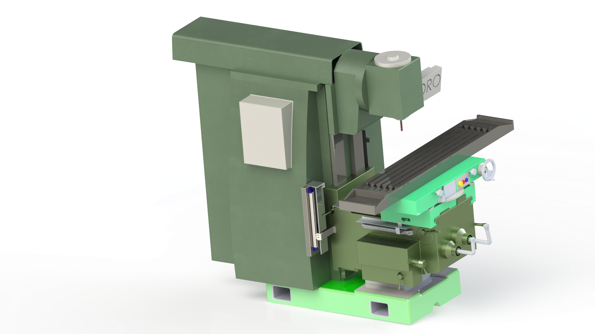
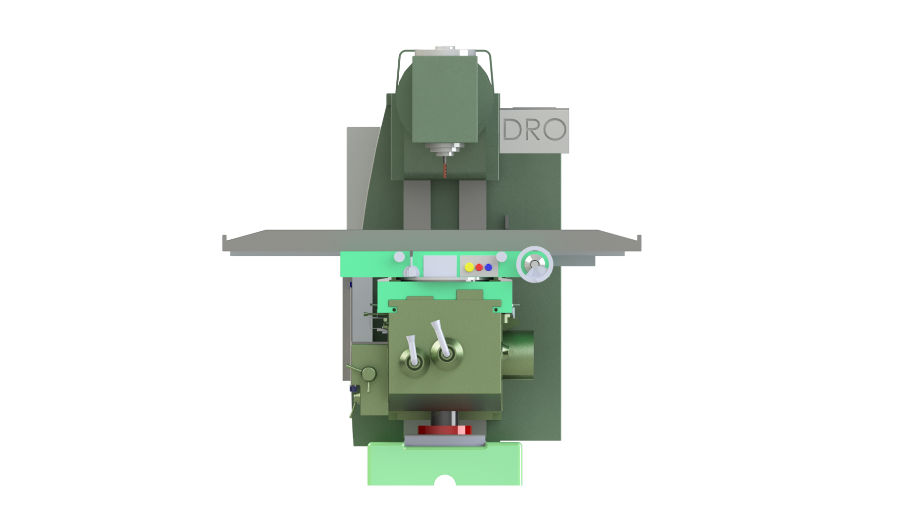
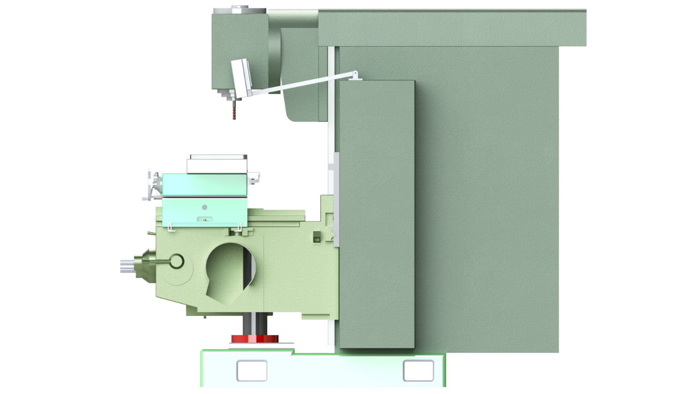
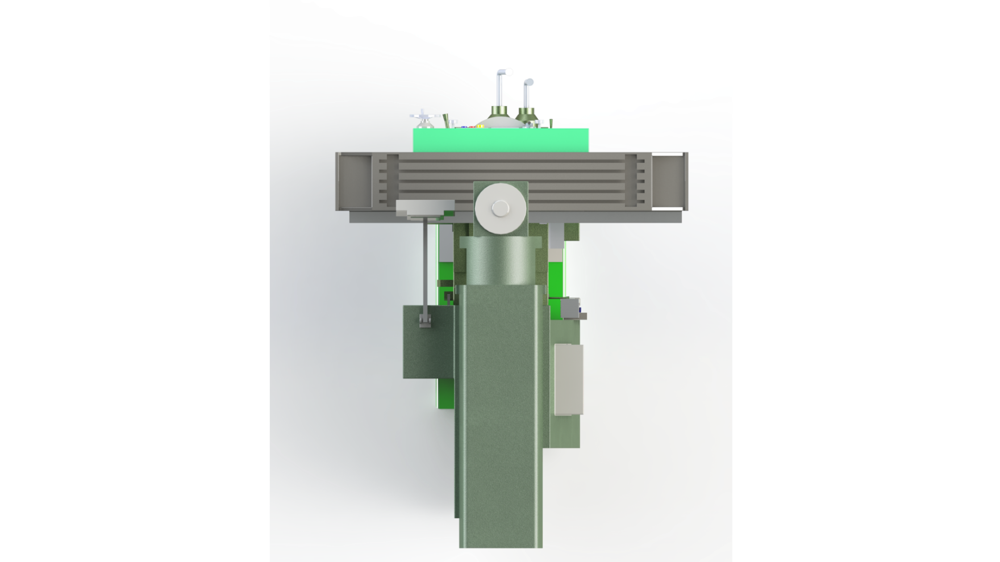

# Digital Readout (DRO) Installation for Milling Machine

Design study and CAD implementation of a **Digital Readout (DRO) position-measurement system for a manual universal milling machine**. The project focuses on improving axis-position measurement by replacing the existing mechanical graduated scales/verniers with digital position measurement using linear encoders and a DRO display.

The project was carried out during an industrial internship at **Andisheh Shomal Machine Manufacturing Co.** and includes machine study, DRO investigation, linear magnetic scale selection, installation planning, SolidWorks modeling, engineering drawings, and supporting design analysis.

## Project Objectives

- Study the structure and operation of the target universal milling machine
- Evaluate the existing mechanical position-measurement system
- Investigate an existing milling machine equipped with a DRO as a reference system
- Select a suitable DRO and linear measurement system for the X, Y, and Z axes
- Define practical installation locations for linear scales and read heads
- Design and model the required installation arrangement in SolidWorks
- Check alignment, interference, accessibility, and cable-routing considerations
- Prepare engineering drawings for the relevant machine components
- Investigate alternative position-measurement and workpiece-location solutions
- Document the proposed installation and technical findings

## Project Scope

The main engineering problem is the measurement of the position of the **X, Y, and Z axes** of a manual milling machine. The target machine originally uses mechanical graduations and verniers for position measurement. According to the internship report, the observed smallest graduation was approximately **0.05 mm**, while mechanical backlash was also identified as a source of positioning uncertainty.

The proposed solution uses a three-axis DRO system with linear encoders. The system measures actual linear axis displacement and displays the position digitally to the operator, reducing dependence on manual reading of the mechanical scales.

## Target Milling Machine

The target machine is an **Arsenal FU 321M universal milling machine** with a vertical spindle/head configuration.

| Parameter | Value |
| --- | --- |
| Manufacturer | Arsenal |
| Model | FU 321M / ФУ 321М |
| Year | 1992 |
| Country | Bulgaria |
| Serial number | N 8698 |
| Axes | 3 (X, Y, Z) |
| Table size | 1350 × 320 mm |
| X travel | approximately 1000 mm |
| Automatic X travel | 980 mm |
| Y travel | approximately 500 mm |
| Automatic Y travel | 480 mm |
| Z travel | approximately 460 mm |
| Automatic Z travel | 440 mm |
| Spindle taper | ISO 50 |
| Spindle speeds | 18 |
| Spindle speed range | 32–1600 rpm |
| Main motor power | 7.5 kW |
| Feed motor power | 2.2 kW |
| Machine mass | 2780 kg |
| Existing position measurement | Mechanical graduation / vernier |
| Existing DRO | None |

## Reference Milling Machine

A second milling machine equipped with a DRO was investigated as the reference installation. This machine is a **JAFO FWF 32J2** universal milling machine manufactured in Poland in 1991.

The reference machine was used to study the practical arrangement of the DRO display, linear scales, read heads, cable routing, and general installation concept before developing the proposed system for the target machine.

## DRO System

The investigated reference system uses an **ATEK Sensor Technologies ADR10-3** three-axis Digital Readout.

### Main DRO Specifications

| Parameter | Value |
| --- | --- |
| Manufacturer | ATEK Sensor Technologies |
| Model | ADR10-3 |
| Type | 3-axis Digital Readout |
| Axes | X, Y, Z |
| Encoder input | Incremental encoder |
| Encoder signals | A/A, B/B, Z/Z line-driver signals |
| Encoder connector | D-Sub 9-pin |
| Units | Metric / Inch |
| Adjustable resolution | 0.1, 0.2, 0.5, 1, 5, 10, 25 µm or user-defined |
| Display | 8 digit + sign digit |
| Supply | 85–265 VAC, 10 W max |
| Dimensions | 320 × 202 × 84 mm |
| Approx. mass | 2.7 kg |
| Coordinate memory | Up to 1000 coordinates |
| Communication | RS-232 |

The report also documents functions including Absolute/Incremental modes, metric/inch conversion, axis reset, linear and segmented error compensation, workpiece-center finding, drilling-pattern functions, radius functions, tool compensation, coordinate memory, and other machining utilities.

## Linear Measurement System

The proposed axis measurement system uses magnetic linear scales and read heads. The investigated system is based on:

- **MLS110** magnetic read head
- **B5** compatible magnetic tape
- **5 µm** resolution
- **5 VDC / TTL RS-422 line-driver** interface
- A/A, B/B, Z/Z signals
- Approximately 3 m shielded spiral cable
- Protective profile for the magnetic scale

Separate CAD components are provided for the X-, Y-, and Z-axis linear-scale arrangements.

## Installation Design

The SolidWorks assembly represents the proposed installation arrangement on the milling machine. The CAD package includes the machine assembly, DRO display, linear-scale components, read-head components, mounting elements, and associated mechanical parts.

The design process considers:

- Linear-scale positioning for the X, Y, and Z axes
- Read-head alignment
- Mechanical interference
- Available installation space
- Preservation of the machine's axis travel
- Accessibility for maintenance
- Cable-routing requirements
- Protection from chips, oil, and vibration
- Manufacturability of required mounting components

The internship report describes the intended workflow as measurement and inspection of the machine, equipment selection, bracket design, SolidWorks assembly development, interference/alignment checks, and preparation for installation and calibration.

## CAD Model

The main CAD assembly is located in [`CAD/Assembly/`](CAD/Assembly/).

The assembly contains SolidWorks parts for the milling machine and the proposed DRO installation, including the X/Y/Z linear-scale components:

- `Assem1.SLDASM` — main milling-machine assembly
- `DRO.SLDPRT` — DRO display model
- `LSx.SLDPRT` — X-axis linear-scale component
- `LSy.SLDPRT` — Y-axis linear-scale component
- `LSz.SLDPRT` — Z-axis linear-scale component
- Machine components such as Base, Column, Knee, Saddle, Table, and related parts

## Engineering Drawings

The [`CAD/Drawings/`](CAD/Drawings/) directory contains the supplied SolidWorks drawing files and PDF drawings for the main machine components.

Included drawing sets:

- Base
- Column
- Knee
- Knee2
- Saddle
- Table

Both editable `.SLDDRW` files and PDF versions are included where supplied.

## Rendering
## CAD Renderings

  
  

  
  

## Alternative Solutions

The report also investigates alternatives to the basic DRO installation, particularly solutions for workpiece positioning and setup:

- **Edge Finder** — for locating workpiece edges and establishing machining references
- **Touch Probe** — for automated or semi-automated workpiece measurement and setup

These alternatives are considered from the perspective of accuracy, cost, installation complexity, operating conditions, and maintenance requirements.

## Market Comparison

Several commercial DRO systems were compared in the report, including:

| System | Application / Level | Main characteristic |
| --- | --- | --- |
| A-Tek ADR10-3 | Milling / Lathe / etc. | Many software functions |
| SINO SDS6-3V | Milling / Lathe / Grinding | Extensive functions and compensation |
| Easson ES-14B | Milling / Lathe / Grinding | Strong and versatile functions |
| Acu-Rite DRO100 / DRO203 | Milling / Lathe | Industrial and application-specific options |
| Fagor 30i-M | Milling / Boring | Industrial compensation and functions |
| Mitutoyo KA-200 | Manual milling / Lathe | Robust absolute-scale ecosystem |
| HEIDENHAIN ND 7013 | Manual milling / Turning | Premium system with advanced functions |

The report presents indicative international and approximate Iranian-market prices for these alternatives. Prices are market-dependent and should be re-verified before procurement.

## Documentation

- [`DRO_Milling_Machine_Persian_Report.pdf`](Documentation/DRO_Milling_Machine_Persian_Report.pdf) — Internship's Report (Persian)
- [`DRO_Milling_Machine_English_Report.pdf`](Documentation/DRO_Milling_Machine_English_Report.pdf) — Internship's Report (English)
- [`CAD/Assembly/`](CAD/Assembly/) — SolidWorks assembly and part files
- [`CAD/Drawings/`](CAD/Drawings/) — engineering drawings in PDF and SolidWorks formats

## Software and Tools

- SolidWorks — 3D modeling, assembly, engineering drawings, and simulation-related work
- Digital Readout / Linear Encoder documentation — equipment selection and technical review

## Project Status

The repository contains the project documentation and the developed CAD design package for the proposed DRO installation. The internship report describes physical installation, calibration, and before/after testing as planned execution stages; they should not be interpreted as completed experimental results unless explicitly documented in the report.

## Internship

**Company:** Andisheh Shomal Machine Manufacturing Co.  
**Project:** Improvement of Milling Machine Position Measurement Using a Digital Readout (DRO) System  
**Intern:** Mohammadreza Sotoudeh  
**Supervisors:** Eng. Hosseinpour and Eng. Nasiri  
**Period:** Summer 1405

## Author

**Mohammadreza Sotoudeh**  
B.Sc. Student in Mechanical Engineering  
Sharif University of Technology
